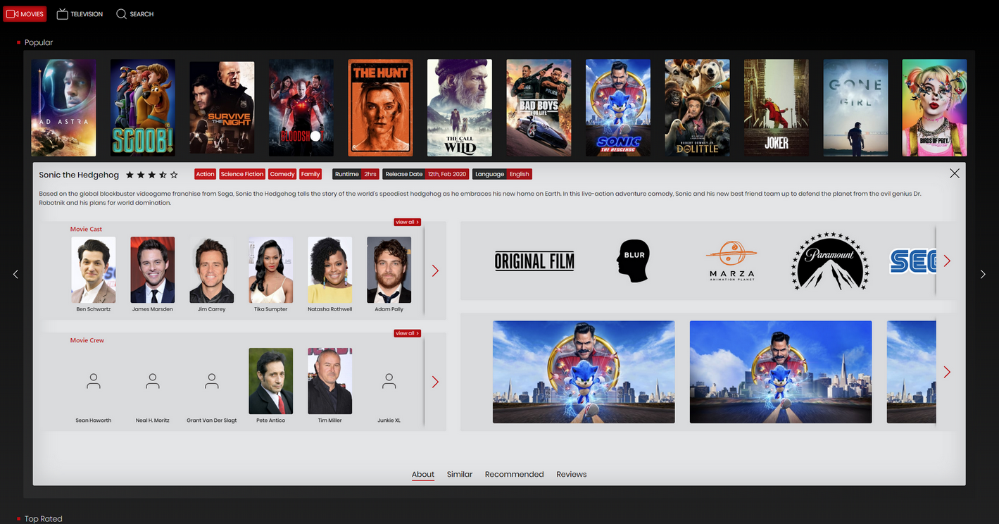

# Flixy

<!--- These are examples. See https://shields.io for others or to customize this set of shields. You might want to include dependencies, project status and licence info here --->

[](https://www.codacy.com/manual/prabhuignoto/flixy?utm_source=github.com&amp;utm_medium=referral&amp;utm_content=prabhuignoto/flixmov&amp;utm_campaign=Badge_Grade)


## Getting Started

To install Flixy, follow these steps:

```bash
cd ./server
yarn install && yarn dev

cd ./ui
yarn install && yarn start
```

## Flixy Home



## Built with

* [React](https://reactjs.org/)
* [Styled Components](https://styled-components.com/)
* [Typescript](https://www.typescriptlang.org/)
* [Node](https://nodejs.org/en/)
* [Fastify](https://www.fastify.io/)
* [GraphQL](https://graphql.org/)
* [Apollo Client & Server](https://www.apollographql.com/)

## Contributing to Flixy
<!--- If your README is long or you have some specific process or steps you want contributors to follow, consider creating a separate CONTRIBUTING.md file--->
To contribute to <project_name>, follow these steps:

1. Fork this repository.
2. Create a branch: `git checkout -b <branch_name>`.
3. Make your changes and commit them: `git commit -m '<commit_message>'`
4. Push to the original branch: `git push origin <project_name>/<location>`
5. Create the pull request.

Alternatively see the GitHub documentation on [creating a pull request](https://help.github.com/en/github/collaborating-with-issues-and-pull-requests/creating-a-pull-request).

## Contributors

* [@prabhuignoto](https://github.com/prabhuignoto)

## Contact

If you want to contact me you can reach me at prabhu.m.murthy@gmail.com.

## License

Distributed under the MIT License. See LICENSE for more information.
